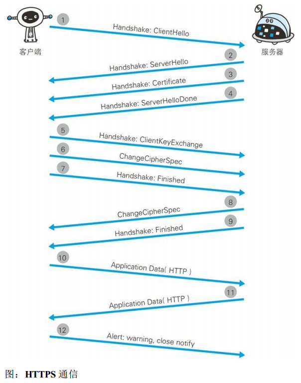
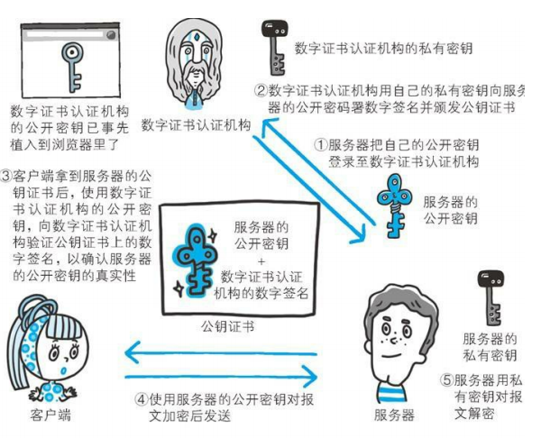

**HTTP+ 加密 + 认证 + 完整性保护 = HTTPS**

我们把添加了加密及认证机制的 HTTP 称为 HTTPS（HTTP Secure）。

通常，HTTP  直接和 TCP  通信。当使用 SSL  时，则演变成先和 SSL  通信，再由 SSL  和 TCP  通信了。

混合加密机制：在交换密钥环节使用**非对称密钥**加密方式，之后的建立通信交换报文阶段则使用**对称密钥**加密方式。

数字证书认证机构（CA，Certificate Authority）和其相关机关颁发的公开密钥证书用于证明公开密钥正确性。数字证书认证机构处于客户端与服务器双方都可信赖的第三方机构的立场上。

接到证书的客户端可使用数字证书认证机构的公开密钥，对那张证书上的数字签名进行验证，一旦验证通过，客户端便可明确两件事：

- 认证服务器的公开密钥的是真实有效的数字证书认证机构。
- 服务器的公开密钥是值得信赖的。

如何获取认证机构的公开密钥：多数浏览器会事先在内部植入常用认证机关的公开密钥。

SSL 的慢分两种。一种是指通信慢。另一种是指由于大量消耗CPU 及内存等资源，导致处理速度变慢。

详细通信过程解读参考《图解HTTP》7.2 节。

更多HTTP介绍参考《图解HTTP》。