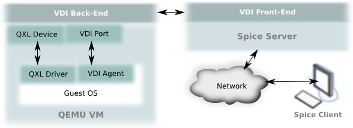

- https://www.spice-space.org/spice-user-manual.html

## 介绍

Spice 是一个开源的远程计算解决方案，提供客户端访问远程显示器和设备。主要用途是远程访问虚拟机。

Spice 提供了类似于桌面的用户体验，同时尝试卸载大部分密集型 CPU 和 GPU 任务交给客户端。

Spice 的基本组成部分是：

- Spice Server
- Spice Client
- Spice Protocol

## Spice 和 Spice 相关组件

- Spice server

Spice server 在`libspice`中实现，它是一个可插拔 VDI 库。当前，其主要使用者是 qemu，QEMU 使用 Spice-server 通过 Spice 协议提供对虚拟机的远程访问。

Virtual Device Interface (VDI) 定义了一组接口，这些接口提供了一种标准方式去发布虚拟设备（例如显示设备、键鼠）和使不同的 Spice 组件能够与这些设备交互。

- Spice Client

Spice client 是被终端用户通过 spice 访问远程系统的程序。例如 remote-viewer、Gnome Boxes 等。

- QXL Device and Drivers

Spice Server 支持 QXL VDI 接口。当 qemu 使用 libspice 的时候，一个特定的视频 PCI 设备可以用于提升远程显示性能和增强客户机图像系统的图像能力。这个视频设备被称作一个 QXL 设备并且要求客户机有 QXL 驱动来实现完整功能。但是，在没有驱动时，则支持标准 VGA。

- Spice Agent

Spice Agent 是一个可选组件，用于增强用户体验和执行面向客户机的管理任务。例如，当使用客户端鼠标模式时，agent 将鼠标位置和状态注入到客户机。它还能让你能够在客户机与客户端之间自由移动鼠标。agent 的其他功能包括共享剪贴板以及进入全屏模式时使客户机分辨率与客户端一致。

- VDI Port Device

Spice 协议支持客户端与服务端代理之间的通信通道。当使用 qemu 时，spice agent 运行在客户机中，VDI 端口是一个用于和 agent 通信的 QEMU PCI 设备。

- Spice Protocol

Spice 协议定义了各种 spice 组件之间通信的消息和规则。

## 特性

### 多通道

服务端与客户端通过通道（channel）来进行通信。每个通道专用于特定类型的数据。下面是可用的通道。

#### Main

控制和配置。

#### Display

图像命令，图像和视频流。

#### Inputs

键鼠输入。

#### Cursor

光标设备位置及形状。

#### Playback

从服务端接收的将由客户端播放的音频。

#### Record

客户端的录音。

#### Smartcard

将智能卡数据从客户端传输到客户机操作系统。

#### USB

重定向插入到客户端的USB设备到客户机操作系统。

### 图像压缩

### 视频压缩

### 鼠标模式

#### 服务端鼠标

#### 客户端鼠标

### 其他特性

#### 多显示器

支持任意数量的显示器。

#### 任意分辨率

在使用 QXL 驱动时，客户机的分辨率会被自动调整为客户端窗口的大小。

#### USB 重定向

#### 智能卡重定向

除了重定向之外，智能卡在客户端操作系统和客户机操作系统中都可以使用。

#### 双向音频

spice 支持音频的播放和录制。播放使用 OPUS 算法进行压缩。

#### 口型同步

在音频和视频之间进行口型同步。仅在启用视频流时可用。

#### 迁移

切换通道连接以支持服务器迁移。

#### 像素与调色板缓存

图像数据被缓存在客户端以避免发送同样的数据。

