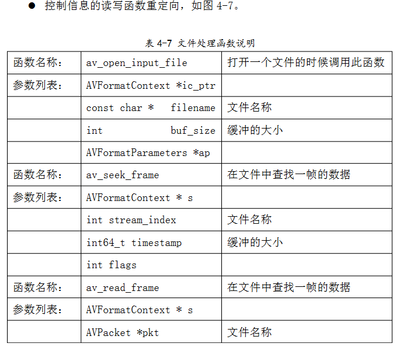

# ffmpeg-1.2.2 与 vdagent-win-0.8
### 视频文件的读写函数重定向
```C
    int avio_read(AVIOContext *s, unsigned char *buf, int size)
    int64_t avio_seek(AVIOContext *s, int64_t offset, int whence)
    int64_t avio_size(AVIOContext *s)
    int avio_open(AVIOContext **s, const char *filename, int flags)
    int avio_close(AVIOContext *s)
```

当虚拟机播放视频过程中调用以上的函数时，会把文件名信息，读取文件的
长度等信息发送给客户端的播放器，播放器的 FFMPEG 的底层函数会通过 Socket
的方式读取文件数据,数据的读写传输在下面的章节会详细说明。
**猜想：**1.vdagent调用被修改过的ffmpeg接口，ffmpeg接口会按照vdagent的消息形式发送控制信息到Client；2.ffmpeg的接口被调用的时候会触发一个hook，此时会调用vdagent方法发送信息到Client

### 控制信息的读写函数重定向

以上的这些函数在需要重定向到客户端，客户端的播放器依据传回来的控制
信息来播放视频过程。

av_open_input_file已经弃用了：

- avformat.h
- 
    Add avformat_open_input and avformat_write_header().
    Deprecate av_open_input_stream, av_open_input_file,
    AVFormatParameters and av_write_header.

发送控制信息到客户端需要实现的函数

- 发送播放视频文件的文件名 <br>
SendFileName(const char *filename)； av_open_input_file 中调用
- 得到播放视频文件的窗口坐标 <br>
SendDisplayArea(const int nWidth,const int nHeight)； video_image_display 中在 SDL_DisplayYUVOverlay 之后调用
- 快进，快退控制 <br>
SendSeekPos(int64_t timestamp, int flags)； av_seek_frame 中调用

### ffmpeg如何与vdagent通信

# 文件传输模块的实现

Guest OS 和 Client OS 之间的通过 UDP 进行文件传输

# Client OS 视频播放模块

- 基于SDL的视频播放器的实现。
- spice客户端的重新编译，添加与播放器互动的代码。
