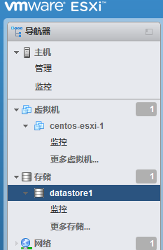
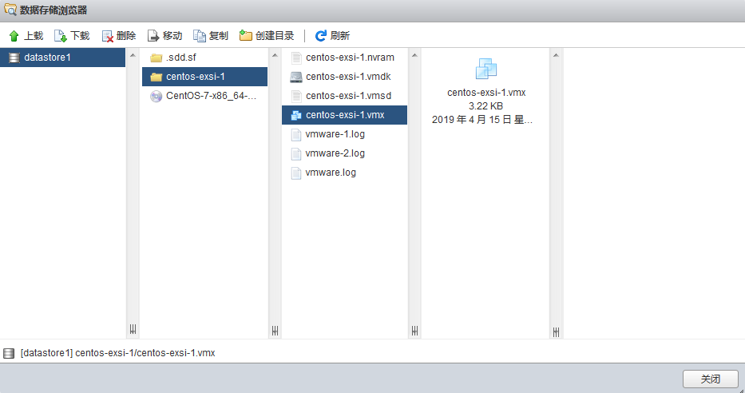

**目录**

[TOC]

利用VMware平台的虚拟机工作目录进行虚拟机转换。

本模式有两种转换方式：

- 通过直接读取本地工作目录进行转换
- 通过远程链接读取工作目录进行转换

# 1. 本地转换

## 1.1 获取虚拟机的工作目录

对于工作在Windows的VMware Workstation上的虚拟机，可以直接查看其工作目录（选中虚拟机->右键->设置->选项->常规->工作目录）。

将工作目录整个拷贝或挂载到`转换服务器`，转换脚本即可从本地读取虚拟机文件，进行转换工作。

## 1.2 构造输入选项

在vmx模式的本地转换方式下，转换脚本的输入选项有以下几个：

- `--mode`：输入模式。此处应选vmx。
- `--file`：工作目录下的虚拟机的`.vmx`文件。

#### 举例说明

现在VMware Workstation有一台虚拟机叫做`Client`，其共享的工作目录是`Client`，想要通过vmx模式对其进行转换。

直接将**整个文件夹**放到转换服务器上；

或者将其挂载到转换服务器，在转换服务器上执行挂载命令：

```shell
yum install cifs-utils
mount.cifs //172.16.2.27/Client client/ -o user=phy,pass=KVM.123456,sec=ntlm
```

其中`172.16.2.27`是Windows的IP地址；`Client`是虚拟机的共享工作目录；`client/`是转换服务器上面的一个文件夹；`user`、`pass`分别是Windows登录的用户名和密码。


然后转换脚本的输入选项这样构造：

```shell
--mode vmx --file client/Client.vmx
```

# 2. 远程转换

此方式是通过构造访问ESXi服务器上的虚拟机文件的`URI`方式来转换虚拟机的。

**注意**：此种方式不能转换带有快照的虚拟机。

## 2.1 设置免密登录

在转换之前，需要对ESXi设置免密登录。

首先启用ESXi的SSH功能，然后添加转换服务器的公钥到ESXi服务器：

1. 在转换服务器上查看公钥：`cat ~/.ssh/id_rsa.pub`，没有的话先生成密钥对：`ssh-keygen -t rsa`
2. 复制公钥并添加到ESXi服务器下的`/etc/ssh/keys-root/authorized_keys`文件中

3. 接着将私钥给`ssh-agent`托管：

    1. 在转换服务器上执行：`eval $(ssh-agent -s)`
    
    2. 在转换服务器上执行：`ssh-add`
    
    3. 从转换服务器通过ssh登录到ESXi服务器进行免密登录验证

## 2.2 构造URI

指向vmx文件的URI，类似于这样：

```shell
ssh://root@esxi.example.com/vmfs/volumes/datastore1/my%20guest/my%20guest.vmx
```

- `root`：登录到ESXi的用户名
- `esxi.example.com`：ESXi服务器的IP地址或域名
- `vmfs/volumes`：固定参数，表示磁盘文件
- 剩余部分：定位到vmx文件的路径。

**注意**：如果URI链接中存在特殊符号则需要替换为ASCII 十六进制码。比如`ssh://root@esxi.example.com/vmfs/volumes/datastore1/my guest/my guest.vmx`应写为`ssh://root@esxi.example.com/vmfs/volumes/datastore1/my%20guest/my%20guest.vmx`（空格的ASCII 十六进制码是20）。

定位到vmx文件的路径查看步骤：

1. 首先在网页端登录到ESXi服务器，

2. 然后点击存储标签，选择一个存储域，



3. 点击`数据存储浏览器->选择一个存储域->选择虚拟机工作目录->选择vmx文件`，出现界面：

    

vmx文件路径即可填写此路径。例如根据上图中的路径其URI为：

```shell
ssh://root@172.16.2.179/vmfs/volumes/datastore1/centos-exsi-1/centos-exsi-1.vmx
```

## 2.3 构造输入选项

在vmx模式的远程转换方式下，转换脚本的输入选项有以下几个：

- `--mode`：转换模式。此处为vmx。
- `--uri`：定位到虚拟机vmx文件的远程链接。

# 3. 转换到ovirt平台

参考：[转换到ovirt平台](转换到ovirt平台.md)

