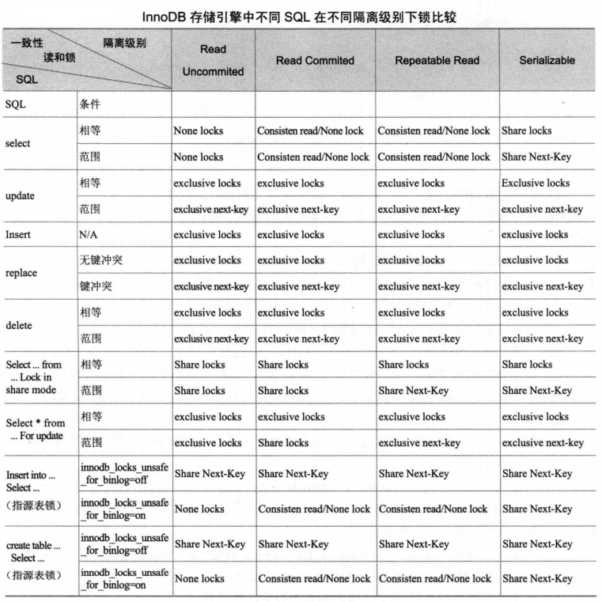

[TOC]

## MySQL 锁概述

相对其他数据库而言， MySQL的锁机制比较简单， 其最显著的特点是不同的存储引擎支持不
同的锁机制。

三种锁特性：

- 表级锁：开销小，加锁快；不会出现死锁；锁定粒度大，发生锁冲突的概率最高,并发度最低。
- 行级锁：开销大，加锁慢；会出现死锁；锁定粒度最小，发生锁冲突的概率最低,并发度也最高。
- 页面锁： 开销和加锁时间界于表锁和行锁之间； 会出现死锁； 锁定粒度界于表锁和行锁
    之间，并发度一般。

仅从锁的角度来说： 表级锁更适合于以查询为主， 只有少量按索引条件更新数据的应用， 如
Web 应用；而行级锁则更适合于有大量按索引条件并发更新少量不同数据，同时又有并发查询的应用，如一些在线事务处理（OLTP）系统。

## MyISAM 表锁

MyISAM 存储引擎只支持表锁。

### 查询表级锁争用情况

通过检查 table_locks_waited 和 table_locks_immediate 状态变量来分析系统上的表锁定争夺：

```MySQL
MariaDB [MYISAM_TEST]> SHOW STATUS LIKE "TABLE%";
+-----------------------+-------+
| Variable_name         | Value |
+-----------------------+-------+
| Table_locks_immediate | 84    |
| Table_locks_waited    | 0     |
+-----------------------+-------+
```

Table_locks_waites 越大，争夺情况越严重。

### MySQL 表级锁的锁模式

MySQL 的表级锁有两种模式： 表共享读锁 （Table Read Lock） 和表独占写锁 （Table Write Lock）。


可见， 对 MyISAM 表的读操作， 不会阻塞其他用户对同一表的读请求， 但会阻塞对同一表的
写请求；对 MyISAM 表的写操作，则会阻塞其他用户对同一表的读和写操作；MyISAM 表的读操作与写操作之间，以及写操作之间是**串行的**！

### 如何加表锁

MyISAM 在执行查询语句（SELECT）前，会自动给涉及的所有表加读锁，在执行更新操作
（UPDATE、DELETE、INSERT 等）前，会自动给涉及的表加写锁。

给 MyISAM 表显示加锁， 一般是为了在一定程度模拟事务操作， 实现对某一时间点多个表的
一致性读取。例：

```MySQL
Lock tables orders read local, order_detail read local;
Select sum(total) from orders;
Select sum(subtotal) from order_detail;
Unlock tables;
```

!!! important
	在用 LOCK TABLES 给表显式加表锁时，必须同时取得所有涉及到表的锁，并且 MySQL 不
	支持锁升级。在执行 LOCK TABLES 后，只能访问显式加锁的这些表，不能访问未加锁的表；同时，如果加的是读锁，那么只能执行查询操作，而不能执行更新操作。 MyISAM 总是一次获得 SQL 语句所需要的全部锁，这也正是不会出现死锁的原因。

!!! warning
	当使用 LOCK TABLES 时，不仅需要一次锁定用到的所有表，而且，同一个表在 SQL 语句
	中出现多少次，就要通过与 SQL 语句中相同的别名锁定多少次，否则也会出错！<br>正确写法：`mysql> lock table actor as a read,actor as b read;`

### 并发插入（Concurrent Inserts）

在一定条件下，MyISAM 表也支持查询和插入操作的并发进行（**删除和更新操作会阻塞！**）。

控制该权限的系统变量是`concurrent_insert`：

- 设置为0时，不允许并发插入。
- 设置为1时，如果MyISAM表中没有空洞（即表的中间没有被删除的行）， MyISAM允许在一个进程读表的同时，另一个进程从表尾插入记录。这也是 MySQL 的**默认设置**。
- 设置为2时，无论MyISAM表中有没有空洞，都允许在表尾并发插入记录。

### MyISAM 的锁调度

即使读请求先到锁等待队列， 写请求后到， 写锁也会插到读锁请求之前！这是因为 MySQL 认为**写请求一般比读请求优先级更高**。

这也正是 MyISAM 表不太适合于有大量更新操作和查询操作应用的原因， 因为大量的更新操作会造成查询操作很难获得读锁， 从而可能永远阻塞。[如何调节](https://dev.mysql.com/doc/refman/5.5/en/table-locking.html)：

- 通过指定启动参数 low-priority-updates，使MyISAM引擎默认给予读请求以优先的权利。
- 通过执行命令SET LOW_PRIORITY_UPDATES=1，使该连接发出的更新请求优先级降低。
- 通过指定INSERT、UPDATE、DELETE语句的LOW_PRIORITY属性，降低该语句的优先级。

- 给系统参数`max_write_lock_count`设置一个合适的值，当一个表的读锁达到这个值后，MySQL就暂时将写请求的优先级降低，给读进程一定获得锁的机会。

应用中应**尽量避免出现长时间运行的查询操作**，不要总想用一条SELECT语句来解决问题。

## InnoDB 锁

### 事务

参考[6. 事务](6. 事务.md)

### 获取 InnoDB 行锁争用情况

检查状态变量`InnoDB_row_lock`：

```MySQL
MariaDB [blog]> SHOW STATUS LIKE 'INNODB_ROW_LOCK%';
+-------------------------------+-------+
| Variable_name                 | Value |
+-------------------------------+-------+
| Innodb_row_lock_current_waits | 0     |
| Innodb_row_lock_time          | 0     |
| Innodb_row_lock_time_avg      | 0     |
| Innodb_row_lock_time_max      | 0     |
| Innodb_row_lock_waits         | 0     |
+-------------------------------+-------+
```

还可以通过设置`InnoDB Monitors` 来进一步观察发生锁冲突的表、数据行等，并分析锁争用的原因。[更多监视器（标准监视器、锁监视器、表空间监视器、表监视器）](https://dev.mysql.com/doc/refman/5.5/en/innodb-monitors.html)

```MySQL
-- 通过建表语句开启监视器
CREATE TABLE innodb_monitor(a INT) ENGINE=INNODB;
-- 用下面的语句来进行查看
SHOW ENGINE INNODB STATUS\G;
-- 通过删表语句停止监视器
DROP TABLE innodb_monitor;
```

如果开启了锁监视器`InnoDB Lock Monitor`，输出也会包括它。

如果开启了监视器，每过15s，会向mysqld服务的标准错误输出`stderr`。具体输出到哪里根据操作系统决定：

- Windows：stderr重定向到默认的日志文件
- Unix&Unix-like：stderr通常被定向到终端

两者都可以通过配置改变。

### 锁的类型

#### 行锁：共享锁与排它锁

- [shared (`S`) lock](https://dev.mysql.com/doc/refman/5.5/en/glossary.html#glos_shared_lock) ：允许持有锁的事务读取一行。允许其他事务读取锁定对象和获取共享锁，但是不能写入。
- [exclusive (`X`) lock](https://dev.mysql.com/doc/refman/5.5/en/glossary.html#glos_exclusive_lock) ：允许持有锁的事务更新或删除行。阻止任何其他的事务锁定同一行。

如果事务*T1*获取了*r*行的共享锁，从独立的事务*T2*获取*r*行的锁请求的处理方式如下：

- *T2*发出的共享锁请求可以立即被满足。*T1*与*T2*都持有*r*行的共享锁。
- *T2*发出的排它锁请求不能立即满足。

如果事务*T1*获取了*r*行的排它锁，从独立的事务*T2*获取*r*行的锁请求不能被满足。只能等待*T1*释放在*r*行的锁。

#### 表级锁：意向锁

InnoDB支持多粒度锁定（*`multiple granularity locking`*），允许行锁与表锁共存。

它指示事务稍后对表中的行所需的锁（共享S或独占X）类型。For example, a statement such as [`LOCK TABLES ... WRITE`](https://dev.mysql.com/doc/refman/5.5/en/lock-tables.html) takes an exclusive lock (an `X` lock) on the specified table.

- [intention shared lock](https://dev.mysql.com/doc/refman/5.5/en/glossary.html#glos_intention_shared_lock) (`IS`)：表示事务打算在表中的各个行上设置共享锁。
- [intention exclusive lock](https://dev.mysql.com/doc/refman/5.5/en/glossary.html#glos_intention_exclusive_lock) (`IX`)：与上述类似。

For example, [`SELECT ... LOCK IN SHARE MODE`](https://dev.mysql.com/doc/refman/5.5/en/select.html) sets an `IS` lock, and [`SELECT ... FOR UPDATE`](https://dev.mysql.com/doc/refman/5.5/en/select.html) sets an `IX` lock.

意图锁定协议如下：

- 在事务获取一行的`S`之前，必须获取表的`IS`锁或更高等级的锁。
- 在事务获取一行的`X`之前，必须获取表的`Ix`锁。

表级锁类型兼容性：

| 当前锁模式↓ 请求锁模式→ | `X`      | `IX`       | `S`        | `IS`       |
| ----------------------- | -------- | ---------- | ---------- | ---------- |
| `X`                     | Conflict | Conflict   | Conflict   | Conflict   |
| `IX`                    | Conflict | Compatible | Conflict   | Compatible |
| `S`                     | Conflict | Conflict   | Compatible | Compatible |
| `IS`                    | Conflict | Compatible | Compatible | Compatible |

**事务的锁请求如果和已存在的锁兼容则会被满足。**

可通过监视器输出语句查看：[`SHOW ENGINE INNODB STATUS`](https://dev.mysql.com/doc/refman/5.5/en/show-engine.html) 

#### 记录锁 Record Lock

记录锁是一个索引记录上的锁。例如，*SELECT c1 FROM t WHERE c1 = 10 FOR UPDATE;*阻止任何其他事务在*c1 = 10*行的插入、删除、更新。

即使定义了没有索引的表，记录锁也始终锁定索引记录。

#### 间隙锁 Gap Lock

在*索引记录之间的间隙*或*在第一个之前或最后一个索引记录之后的间隙*上的锁。不论记录存在与否都会阻止其它事务的**插入**操作，因为该**范围**内所有现有值之间的间隙是锁定的。

间隙可能跨越单个索引值，多个索引值，甚至可能为空。

#### Next-Key Lock

一个`next-key`锁是一条索引记录的记录锁与在此记录之前的间隙的间隙锁的组合。

InnoDB执行行级锁定，当它搜索或扫描一张表的索引时，在它命中的索引记录上设置共享锁或排它锁。

!!! warning
	在使用范围条件检索并锁定记录时，InnoDB 这种加锁机制会阻塞**符合条件范围内**键值的并发插入， 这往往会造成严重的锁等待。<br>	InnoDB 除了通过范围条件加锁时使用间隙锁外，如果使用相等条件请求给一个不存在的记录加锁，InnoDB 也会使用间隙锁！

### 何时加锁

意向锁是 InnoDB 自动加的， 不需用户干预。 对于 UPDATE、 DELETE 和 INSERT 语句， InnoDB会自动给涉及数据集加排他锁（X)；对于普通 SELECT 语句，InnoDB 不会加任何锁；事务可以通过以下语句显示给记录集加共享锁或排他锁。

- 共享锁（S）：`SELECT * FROM table_name WHERE ... LOCK IN SHARE MODE`
- 排他锁（X)：`SELECT * FROM table_name WHERE ... FOR UPDATE`

用 *SELECT ... IN SHARE MODE*获得共享锁，主要用在需要数据依存关系时来确认某行记录是否存在，并确保没有人对这个记录进行 UPDATE 或者 DELETE 操作。但是如果当前事务也需要对该记录进行更新操作， 则很有可能造成死锁， 对于**锁定行记录后需要进行更新操作的应用**，应该使用 *SELECT... FOR UPDATE* 方式获得排他锁。

### InnoDB 行锁实现方式

InnoDB 行锁是通过给索引上的索引项加锁来实现的。

!!! important
	只有通过索引条件检索数据，InnoDB 才使用行级锁，否则，InnoDB 将使用表锁！

- 虽然是访问不同行的记录， 但是如果是使用相同的索引键（即，使用同一条索引记录），是会出现锁冲突的（阻塞）。
- 当表有多个索引的时候，不同的事务可以使用不同的索引锁定不同的行，另外，不论是使用主键索引、唯一索引或普通索引，InnoDB 都会使用行锁来对数据加锁。即，如果使用了不同的索引访问了同一条数据，也会造成阻塞。

- 即便在条件中使用了索引字段， 但是否使用索引来检索数据是由MySQL 通过判断不同执行计划的代价来决定的。不使用索引的情况下InnoDB 将使用表锁，而不是行锁。

### 恢复和复制的需要，对 InnoDB 锁机制的影响

MySQL 的恢复机制（复制其实就是在 Slave Mysql 不断做基于 BINLOG 的恢复）有以下特点:

- MySQL 的恢复是 SQL 语句级的，也就是重新执行 BINLOG 中的 SQL 语句。这与Oracle 数据库不同，Oracle 是基于数据库文件块的。
- MySQL 的 Binlog 是按照事务提交的先后顺序记录的， 恢复也是按这个顺序进行的。这点也与 Oralce 不同，Oracle 是按照系统更新号（System  Change  Number，SCN）来恢复数据的，每个事务开始时，Oracle 都会分配一个全局唯一的 SCN，SCN 的顺序与事务
    开始的时间顺序是一致的。

从上面两点可知，MySQL 的恢复机制要求：在一个事务未提交前，其他并发事务不能插入满足其锁定条件的任何记录，也就是不允许出现幻读，实际上是要求事务要串行化。

!!! warning 
	`Insert   into target_tab select * from source_tab where ...`和`create   table new_tab ...select ... From   source_tab where ...`时会给 *source_tab *加锁。 还要特别说明的是， 如果上述语句的 SELECT 是范围条件， InnoDB 还会给源表加间隙锁 （Next-Lock）。<br>INSERT...SELECT...和CREATE TABLE...SELECT...语句，可能会阻止对源表的并发更新， 造成对源表锁的等待。MySQL将这种SQL叫作不确定（non-deterministic）的SQL，不推荐使用。

如果应用中一定要用这种 SQL 来实现业务逻辑，又不希望对源表的并发更新产生影响，可以采取以下两种措施：

- 一是采取上面示例中的做法，将 `innodb_locks_unsafe_for_binlog`的值设置为`on` ，强制 MySQL 使用多版本数据一致性读。但付出的代价是可能无法用 binlog 正确地恢复或复制数据，因此，不推荐使用这种方式。
- 二是通过使用 `select * from source_tab ... Into outfile` 和 `load data infile ...`语句组合来间接实现，采用这种方式 MySQL 不会给 source_tab 加锁。

### 不同隔离级别下的一致性读及锁的差异



### 什么时候使用表锁

对于 InnoDB 表，在绝大部分情况下都应该使用行级锁，因为事务和行锁往往是我们之所以选择 InnoDB 表的理由。但在个别特殊事务中，也可以考虑使用表级锁：

- 事务需要更新大部分或全部数据，表又比较大
- 事务涉及多个表，比较复杂，很可能引起死锁，造成大量事务回滚。

在 InnoDB 下，使用表锁要注意以下两点：

- 仅当 autocommit=0 、innodb_table_locks=1（默认设置）时，InnoDB 层才能知道 MySQL 加的表锁。

- 在用 `LOCK  TABLES` 对 InnoDB 表加锁时要注意，要将 `AUTOCOMMIT`设为 0，否则
    MySQL 不会给表加锁； 事务结束前， 不要用 UNLOCK TABLES 释放表锁， 因为 **UNLOCK TABLES 会隐含地提交事务**；`COMMIT` 或 `ROLLBACK` 并不能释放用 LOCK  TABLES 加的表级锁，必须用 `UNLOCK TABLES` 释放表锁。

```MySQL
-- 例如，如果需要写表 t1 并从表 t 读，可以按如下做： 
SET AUTOCOMMIT=0;
LOCK TABLES t1 WRITE, t2 READ, ...;
[do something with tables t1 and t2 here];
COMMIT;
UNLOCK TABLES
```

