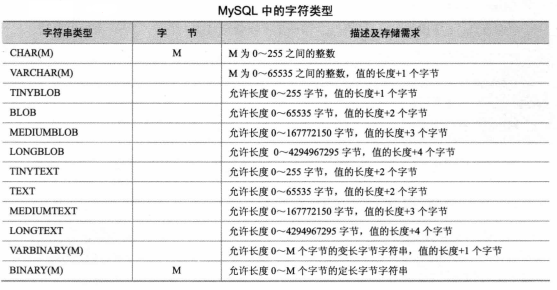

[TOC]

# 8. MySQL数据类型

## 数值类型

### 整型

| Type        | Storage (Bytes) |
| ----------- | --------------- |
| `TINYINT`   | 1               |
| `SMALLINT`  | 2               |
| `MEDIUMINT` | 3               |
| `INT`       | 4               |
| `BIGINT`    | 8               |

```sql
INT[(M)] [UNSIGNED] [ZEROFILL]
```

对于整型数据，支持在名称后面指定显示宽度。

例：

>int(3)
>
>插入5666时，并不会截取精度，而是按照实际精度存储。

这个作用是数值宽度不足时在数字前面填满宽度。一般配合`ZEROFILL`使用。

```sql
ALTER TABLE user MODIFY age int(3) ZEROFILL;
SELECT * FROM user;
+----+--------------+------------+----------------+-------+
| id | name         | createDate | introduction   | age   |
+----+--------------+------------+----------------+-------+
|  2 | chenchm      | 2019-04-01 | newer          |   000 |
| 67 | AGESD        | 2019-05-06 | NULL           | 45662 |
+----+--------------+------------+----------------+-------+
```

**注意**：指定了ZEROFILL时，会自动添加UNSIGNED。

此类型还支持`AUTO_INCREMENT `，一个表中最多只能有一个`AUTO_INCREMENT `字段并应该定义为`NOT NULL、PRIMARY KEY|UNIQUE KEY`。

### 浮点数和定点数

```sql
# 4字节
FLOAT[(M,D)] [UNSIGNED] [ZEROFILL]
# 8字节
DOUBLE[(M,D)] [UNSIGNED] [ZEROFILL]
# M+2字节 定点数 在MySQL内部以字符串形式存放，精度更高
DECIMAL[(M[,D])] [UNSIGNED] [ZEROFILL]
```

- M：精度。表示总共多少位数字。
- D：标度。表示小数点后面有几位。

精度超过时，浮点数四舍五入后存储，不会发出警告；定点数会四舍五入后存储，发出截断警告。

## BIT类型

```sql
BIT[(M)]
```

- M：指定二进制数存放的最大位数。

插入时先将其转换为二进制数，精度不足则插入失败并使用`1`填满位数。

不能直接显示，使用`BIN`（二进制）或`HEX`（十六进制）函数显示。

```sql
MariaDB [blog]> UPDATE test SET id4=2;
Query OK, 1 row affected (0.00 sec)
Rows matched: 1  Changed: 1  Warnings: 0

MariaDB [blog]> SELECT BIN(id4) FROM test;
+----------+
| BIN(id4) |
+----------+
| 10       |
+----------+
1 row in set (0.00 sec)

# 精度不够，插入失败
MariaDB [blog]> UPDATE test SET id4=6;
Query OK, 1 row affected, 1 warning (0.00 sec)
Rows matched: 1  Changed: 1  Warnings: 1

MariaDB [blog]> show warnings ;
+---------+------+----------------------------------------------+
| Level   | Code | Message                                      |
+---------+------+----------------------------------------------+
| Warning | 1264 | Out of range value for column 'id4' at row 1 |
+---------+------+----------------------------------------------+
1 row in set (0.00 sec)

MariaDB [blog]> SELECT BIN(id4) FROM test;
+----------+
| BIN(id4) |
+----------+
| 11       |
+----------+
1 row in set (0.00 sec)
```

## 日期时间类型

|                          Data Type                           |      “Zero” Value       |
| :----------------------------------------------------------: | :---------------------: |
| [`DATE`](https://dev.mysql.com/doc/refman/5.5/en/datetime.html) |     `'0000-00-00'`      |
| [`TIME`](https://dev.mysql.com/doc/refman/5.5/en/time.html)  |      `'00:00:00'`       |
| [`DATETIME`](https://dev.mysql.com/doc/refman/5.5/en/datetime.html) | `'0000-00-00 00:00:00'` |
| [`TIMESTAMP`](https://dev.mysql.com/doc/refman/5.5/en/datetime.html) | `'0000-00-00 00:00:00'` |
| [`YEAR`](https://dev.mysql.com/doc/refman/5.5/en/year.html)  |         `0000`          |

`TIMESTAMP` 会在初始化和更新时自动更新到当前时间戳（插入`NULL/CURRENT_TIMESTAMP`时自动更新），在存储和检索时会自动转换，并且会跟着系统时区改变。

**注意**：MySQL只给表中的第一个TIMESTAMP 字段设置默认值CURRENT_TIMESTAMP，第二个默认值设为`0000-00-00 00:00:00`并且不能再修改成默认值CURRENT_TIMESTAMP。

`TIMESTAMP` 与`DATETIME`的主要区别：

- TIMESTAMP 能表示的范围比较小，1970-xxx ~ 2038-xxx，超出范围则置为0000-00-00 00:00:00；DATETIME的范围大，1000-01-01 ~ 9999-12-31。
- TIMESTAMP 与时区有关
- TIMESTAMP 在更新或插入一条记录但不明确给该字段赋值时也会自动更新成当前时间（可修改）

插入`DATETIME`的合法值，不足的位用`0`补齐，存在非法值用“Zero” Value替换：

- 字符串格式
    - `YYYY-MM-DD HH:MM:SS`
    - `YY-MM-DD HH:MM:SS`
    - `YYYYMMDDHHMMSS`
    - `YYMMDDHHMMSS`
    - `YYYYMMDD`
    - `YYMMDD`
- 数字格式
    - `YYYYMMDDHHMMSS`
    - `YYMMDDHHMMSS`
    - `YYYYMMDD`
    - `YYMMDD`
- 函数返回结果
    - NOW()
    - CURRENT_DATE
    - 等

其它时间类型与之类似。

## 字符串类型

MySQL5.0



### CHAR VARCHAR

检索时，VARCHAR保留尾部空格，CHAR不保留。

```sql
MariaDB [blog]> ALTER TABLE test ADD COLUMN str1 CHAR(4), ADD COLUMN str2 VARCHAR(4);
MariaDB [blog]> SELECT CONCAT(str1, '+'), CONCAT(str2, '+') FROM test;
+-------------------+-------------------+
| CONCAT(str1, '+') | CONCAT(str2, '+') |
+-------------------+-------------------+
| NULL              | NULL              |
| NULL              | NULL              |
| ABC+              | ABC +             |
+-------------------+-------------------+
3 rows in set (0.00 sec)
```

### BINARY VARBINARY

与CHAR、VARCHAR类似，但是存储的是字节字符串而不是字符字符串。意味着它们具有二进制字符集和排序规则，并且比较和排序基于值中字节的数值。

```sql
mysql> CREATE TABLE t (c BINARY(3));
Query OK, 0 rows affected (0.01 sec)

mysql> INSERT INTO t SET c = 'a';
Query OK, 1 row affected (0.01 sec)

mysql> SELECT HEX(c), c = 'a', c = 'a\0\0' from t;
+--------+---------+-------------+
| HEX(c) | c = 'a' | c = 'a\0\0' |
+--------+---------+-------------+
| 610000 |       0 |           1 |
+--------+---------+-------------+
1 row in set (0.09 sec)
```

### BLOB TEXT

`BLOB`用于存储可变数据量的大型二进制对象，值是二进制字符串（字节字符串）。

`TEXT`用于存储可变数据量的大型非二进制对象，值是非二进制字符串（字符字符串）。

类似于`VARBINARY`和`VARCHAR`的放大版？

### ENUM

在创建表的时候规定其取值范围。枚举值必须是引号引起来的字符串类型，并且在检索时使用定义时的大小写。

```sql
MariaDB [blog]> ALTER TABLE test MODIFY COLUMN size ENUM ('S', 'l');

MariaDB [blog]> INSERT INTO test VALUES ('C', 'L');

MariaDB [blog]> SELECT * FROM test;
+---------+------+
| bin_str | size |
+---------+------+
| C       | l    |
+---------+------+
```

枚举值的存储格式如下：

| Value      | Index  |
| ---------- | ------ |
| `NULL`     | `NULL` |
| `''`       | 0      |
| `'value1'` | 1      |
| ...        | ...    |

真正的枚举值从序号1开始存储，**排序的时候是根据序号进行排序的**，可以通过`ORDER BY CAST(col AS CHAR)` or `ORDER BY CONCAT(col)`来使用值进行排序。

### SET

与ENUM类似，不同的是可以选取多个值，而ENUM每次只能选取一个。存储范围：0~64个不重复的值。

- 尾部空格会被删除。
- 检索时使用定义时的大小写。

```sql
MariaDB [blog]> ALTER TABLE test ADD COLUMN set_str SET('A', 'B', 'C');

MariaDB [blog]> INSERT INTO test (set_str) VALUES ('a');
MariaDB [blog]> INSERT INTO test (set_str) VALUES (1);
# 取多值，逗号两边一定不要有空格
MariaDB [blog]> INSERT INTO test (set_str) VALUES ('a,b');

MariaDB [blog]> SELECT set_str FROM test WHERE set_str!='NULL';
+---------+
| set_str |
+---------+
| A       |
| A       |
| A,B     |
+---------+
```

