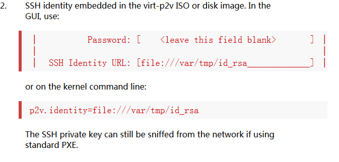
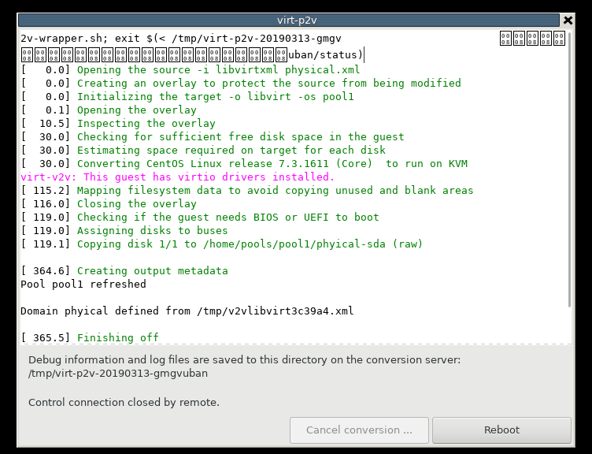

[TOC]

原文地址：[virt-p2v](http://libguestfs.org/virt-p2v.1.html)

不要直接运行`virt-p2v`。你应该使用可启动`CDROM,ISO,PXE image`来启动物理机。这个映像包括virt-p2v二进制文件，并会自动地运行它。这么做的原因是被转换的磁盘必须是非活动状态，因为其他程序会修改活动磁盘的内容。这个启动映像由`virt-p2v-make-disk`制作。

## 1.网络设置

`virt-p2v`在物理机上面运行。它通过**SSH**与转换服务器（安装了`virt-v2v`）通信。

```shell
 ┌──────────────┐                  ┌─────────────────┐
 │ virt-p2v     │                  │ virt-v2v        │
 │ (physical    │  ssh connection  │ (conversion     │
 │  server)   ╍╍╍╍╍╍╍╍╍╍╍╍╍╍╍╍╍╍╍╍╍╍╍╍╍╍▶ server)       │
 └──────────────┘                  └─────────────────┘
```

`virt-v2v`执行真正的转换。

SSH连接总是从物理机发起。

`virt-p2v`需要SSH的反向端口转发功能`ssh -R`，必须在转换服务器开启此功能。

SSH的scp功能也必须开启。

转换的速度很大程度上取决于两者的网络情况。

## 2.GUI交互式配置

启动映像时，会有一些配置。

### 2.1 SSH配置

### 2.2 磁盘和网络配置

配置虚拟机的参数，virt-v2v的选项，要转换的硬盘，可移动媒体（CD...），要在虚拟机上创建的网络接口

### 2.3 转换运行界面

转换完成之后，关闭物理机，不要重启。

## 3. 内核命令行配置

如果你不想通过图形界面配置，可使用此方法。

在哪里设置命令行参数取决于PXE实现，但是对于pxelinux可以在`pxelinux.cfg`文件中扩展`APPEND`字段。比如：

```shell
 DEFAULT p2v
 TIMEOUT 20
 PROMPT 0
 LABEL p2v
   KERNEL vmlinuz0
   APPEND initrd=initrd0.img [....] p2v.server=conv.example.com p2v.password=secret p2v.o=libvirt
```

下面是所有的命令行参数：

[KERNEL COMMAND LINE CONFIGURATION](http://libguestfs.org/virt-p2v.1.html#kernel-command-line-configuration)

4.SSH认证

比密码方式更安全的是SSH认证。

创建无密码的ssh密钥对，将公钥放在转换服务器的`authorized_keys`中。



## 5.工作方式

首先建立一个或多个SSH连接来查询远程`virt-v2v`的版本及其功能。测试连接在转换开始前会被关闭。

`virt-p2v`准备好转换时，会打开一个SSH控制连接，首先发送一个创建文件夹的命令在转换服务器上创建临时文件夹。格式：`/tmp/virt-p2v-YYYYMMDD-XXXXXXXX`。

其下有如下内容：

***dmesg***

***lscpu***

***lspci***

***lsscsi***

***lsusb***

> ​	*(before conversion)*
>
> ​	物理机上的对应指令输出（即[dmesg(1)](https://www.mankier.com/1/dmesg)，[lscpu(1)](https://www.mankier.com/1/lscpu)）。
>
> ​	*dmesg*输出用于检查错误。其它的输出用于调试新硬件配置。

***environment***

> ​	*(before conversion)*
>
> ​	`virt-v2v`的运行环境

***name***

> ​	*(before conversion)*
>
> ​	物理机的主机名

***physical.xml***

> ​	*(before conversion)*
>
> ​	描述物理机的libvirt XML。通过*-i libvirtxml*选项传递物理机数据给`virt-v2v`。
>
> ​	**注意**：这不是真正的libvirt XML。

***p2v-version***

***v2v-version***

> ​	*(before conversion)*
>
> ​	`virt-v2v`和`virt-p2v`的版本

***status***

> ​	*(after conversion)*
>
> ​	最终的转换后的状态。0代表成功

***time***

> ​	*(before conversion)*
>
> ​	转换的开始时间

***virt-v2v-conversion-log.txt***

> ​	*(during/after conversion)*
>
> ​	转换日志。只有`virt-v2v`命令的输出。

***virt-v2v-wrapper.sh***

> ​	*(before conversion)*
>
> ​	运行`virt-v2v`时执行的封装脚本。

在真正的转换开始之前，`virt-p2v`建立一个或多个连接用于数据传输。

当前的传输协议是ssh代理的`NBD`（Network Block Device）。默认是`qemu-nbd`（QEMU Disk Network Block Device Server）。

普通情况下每个物理硬盘都有一个ssh连接：

```shell
 ┌──────────────┐                      ┌─────────────────┐
 │ virt-p2v     │                      │ virt-v2v        │
 │ (physical    │  control connection  │ (conversion     │
 │  server)   ╍╍╍╍╍╍╍╍╍╍╍╍╍╍╍╍╍╍╍╍╍╍╍╍╍╍╍╍╍╍╍▶ server)       │
 │              │                      │                 │
 │              │  data connection     │                 │
 │            ╍╍╍╍╍╍╍╍╍╍╍╍╍╍╍╍╍╍╍╍╍╍╍╍╍╍╍╍╍╍╍▶               │
 │qemu-nbd ← ─┘ │                      │└─ ← NBD         │
 │/dev/sda      │                      │     requests    │
 ∼              ∼                      ∼                 ∼
 └──────────────┘                      └─────────────────┘
```

因为使用了ssh的反向端口转发功能，所以实际上NBD请求可以从转换服务器发送到物理机。这样`virt-2v`可以通过libguestfs可以打开直接读取物理硬盘的nbd连接。

长长的virt-v2v命令被包装在脚本中然后上传到转换服务器。最后一步就是运行这个脚本，然后运行`virt-v2v`命令。virt-v2v命令引用*physical.xml*文件，该文件又引用`data connection`的NBD监听端口。

```shell
virt-v2v -v -x --colours -i libvirtxml -o "libvirt" -oa sparse -os "/var/tmp" --root first physical.xml </dev/null
```

## 6.使用

首先安装`virt-p2v-maker`。

利用`virt-p2v-make-disk`制作一个运行`virt-p2v`的启动盘：

```shell
# USB启动盘
virt-p2v-make-disk -o /dev/sdX

# 虚拟启动磁盘
virt-p2v-make-disk -v -o /var/tmp/p2v.img centos-7.5 2>&1 | tee virt-p2v.log
```

因为使用VMware虚拟机模拟物理机，所以需要再将其转换为`vmdk`格式：

```shell
qemu-img convert -f raw p2v.img -O vmdk p2v.vmdk
```

然后将这个磁盘添加到虚拟机上面，设置开机启动进入固件，调整硬盘的启动顺序，开机时选择第一个linux内核，此时即进入了`virt-p2v`的启动盘。然后按照提示进行配置即可开始转换。

**注意**：选择libvirt作为输出格式的时候，`os`选项填写`pool`的名字，可通过`virsh pool-list`查看有哪些pool。

